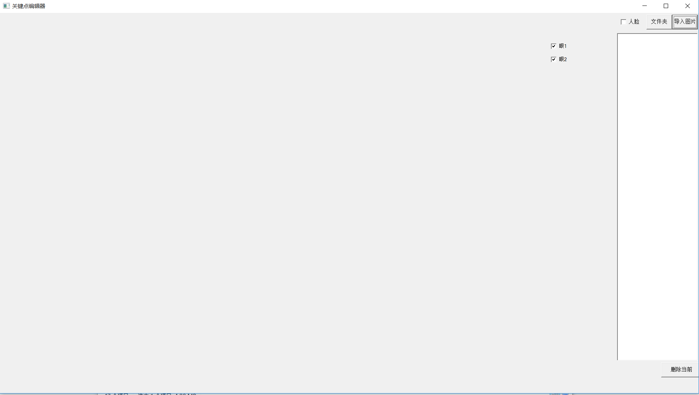
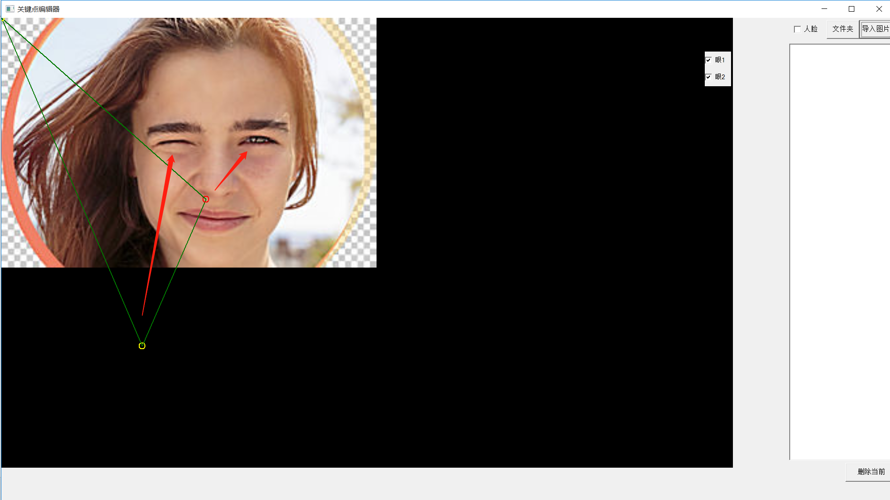
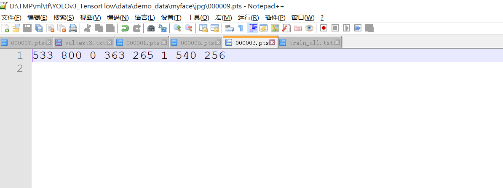

## HyperLabelImg
感谢开源！ 本代码fork自 https://github.com/zeusees/HyperLabelImg
修改了部分代码以满足自身需求。

#### 更新
标注两只眼，并可以添加睁闭眼标志。

#### 编译

该工程基于vs2015，直接打开工程，配置路径下提供的opencv即可编译成功。

#### 使用

##### 1.双击打开程序，如下所示：

##### 2.点击右上角导入文件夹或者单张图片，左边的点标注左眼，右边的标注右眼；复选框：标注睁闭眼；眼1标注左眼，眼2标注右眼：

##### 3.标注完毕，按下CTRL+S保存标注信息，标注信息与标注文件命名相同，后缀为.pts，存在同一目录：

